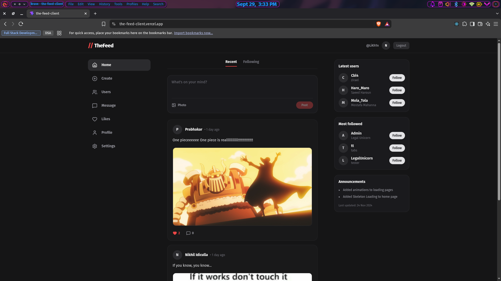

<h1 align="center">//TheFeed</h1>

<p align="center">A modern, full-stack social media MVP (Frontend Repository)</p>



## Demo: [Live on Vercel](https://the-feed-client.vercel.app/)

## Built with

- Vite + React
- Tailwind CSS v3
- React Router DOM
- Axios (with interceptors)
- React Context API
- Vitest & React Testing Library

## Key Features

- Secure JWT authentication and persistent user sessions.
- Uploading of posts with image attachments (via Cloudinary).
- Optimistic UI updates for seamless liking and posting without network lag.
- Fully responsive 3-column dark mode layout.
- Protected routing for authenticated users.

## Upcoming Features

- **Real-time Messaging:** Direct user-to-user live chat powered by WebSockets (Socket.io).
- **User Profiles & Follows:** Search for users, view dedicated profile pages, and follow accounts to curate a custom feed.
- **Profile Customization:** Edit bio, display name, and upload custom profile pictures via Cloudinary.
- **Dedicated Likes Page:** A centralized tab to view all previously liked posts.
- **Settings & Themes:** Native dark/light mode toggle and deeper account configurations.

## Dependencies

- **axios**: Promise-based HTTP client used with interceptors for automatic JWT token attachment.
- **lucide-react**: Beautiful, consistent icon library for UI elements.
- **react**: Core library for building user interfaces.
- **react-dom**: Enables rendering React components in the DOM.
- **react-router-dom**: Routing library for navigating between pages (Login, Signup, Feed).
- **tailwindcss**: Utility-first CSS framework used for rapid UI development and dark theme styling.
- **vitest**: Blazing fast unit testing framework native to Vite.

## Development

Here is how you can start the project locally.

**Prerequisites**

1. Clone the backend API repo and run it. You can head over to the [backend API repo](https://github.com/LiK-h1n/the-feed-api) and follow the README instructions for setting up the Express/Prisma API.

2. Clone the repo

```fish
# HTTPS
$ git clone https://github.com/LiK-h1n/the-feed-client.git

# SSH
$ git clone git@github.com:LiK-h1n/the-feed-client.git
```

3. Create .env

```fish
$ touch .env
```

4. Add the following to .env (Points Vite to your local Express server)

```fish
VITE_API_URL="http://localhost:5000/api"
```

5. Start the project

```fish
$ npm run dev
```

6. Run Tests (Optional)

```fish
$ npm test
```
